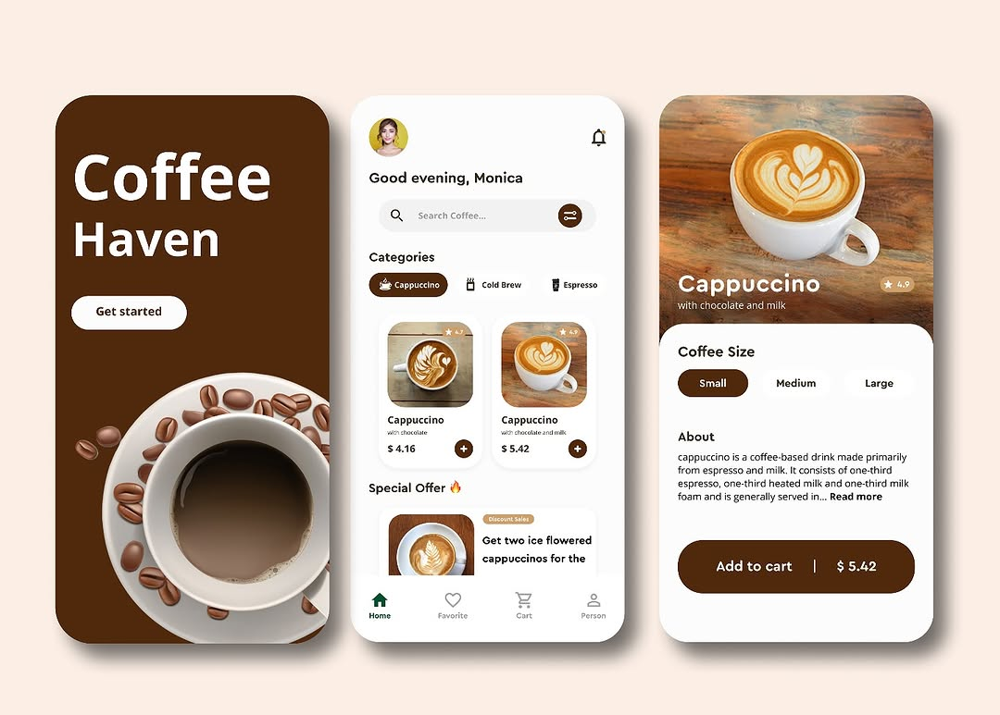

# ☕ Coffee App UI

A simple and modern Coffee App UI built with **Flutter**, using the **MVC architecture** and **GetX**.


including 3 pages from the design reference :
- **Start Page** – Intro screen + branding
- **Home Page** – Main screen with categories and coffees
- **Product Page** – Detailed view of the selected coffee


## 🛠️ Features from GetX Package

- Navigation and Routing  
- State Management 
- Dependency Injection


## 🎬 Demo
<p align="center">
  
</p>


## 🎨 Design Reference
<p align="center">
  
</p>


### Installation
```bash
git clone https://github.com/yourusername/coffee_app_ui.git
cd coffee_app_ui
flutter pub get
flutter run
```


### Getting Started

This project is a starting point for a Flutter application.

A few resources to get you started if this is your first Flutter project:

- [Lab: Write your first Flutter app](https://docs.flutter.dev/get-started/codelab)
- [Cookbook: Useful Flutter samples](https://docs.flutter.dev/cookbook)

For help getting started with Flutter development, view the
[online documentation](https://docs.flutter.dev/), which offers tutorials,
samples, guidance on mobile development, and a full API reference.